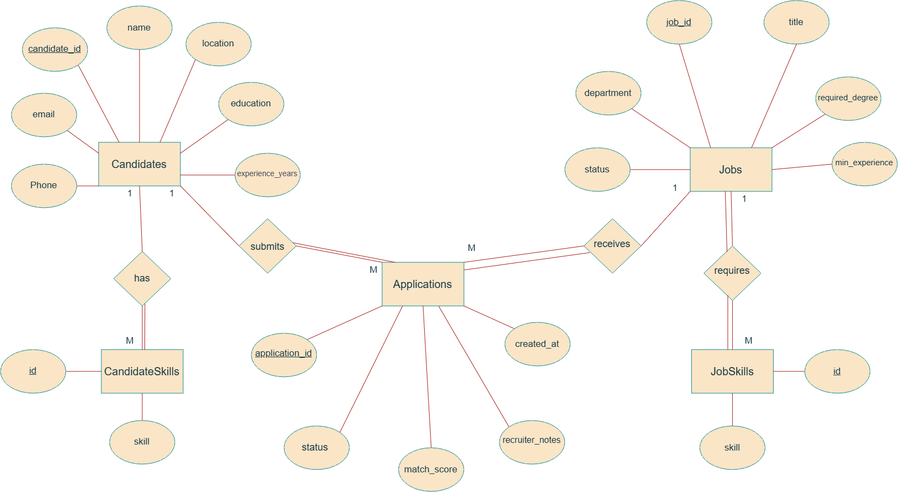

# Talenta-automation-project-phase-2

## Company Overview

**Talenta Partners Group** is a recruitment and staffing agency that connects qualified candidates with client companies across different industries including technology, finance, healthcare, and administration.

Recruiters handle a large amount of information every day, including:

- Candidate profiles and CVs.
- Job requirements.
- Application history.
- Interview evaluations.
- Hiring decisions.

As Talenta grows, the company wants to use an AI assistant to help recruiters analyze candidates and improve the recruitment workflow.

However, recruitment data contains sensitive personal information and important business decisions, so the AI assistant cannot have unrestricted access to the company database.

---

# Problem Statement

Talenta wants to build an **AI Recruitment Assistant** that helps recruiters with daily hiring operations:

- Searching for suitable candidates for open positions.
- Comparing candidate profiles with job requirements.
- Summarizing candidate experience and history.
- Generating interview preparation reports.
- Managing candidate pipeline decisions.

The current workflow requires recruiters to manually review CVs, search candidate records, and update hiring statuses.

This creates several challenges:

- Screening large numbers of candidates takes significant time.
- Decisions may vary between recruiters.
- Important application history may be missed.
- Unauthorized users may access or modify sensitive information.

The main challenge is providing an AI assistant with useful access to recruitment data while preventing unsafe actions.

---

# Proposed Solution: MCP-Based Recruitment Assistant

Instead of allowing the LLM to directly access Talenta's database, we introduce an **MCP Server** as a secure data access layer between the AI assistant and the database.

Architecture:
                Recruiter
                |
                |
                AI Assistant
                |
                |
                MCP Server
                |
                |
                Recruitment Database

The MCP Server is responsible for:

- Providing controlled access to company data.
- Enforcing user permissions.
- Validating tool inputs.
- Protecting sensitive operations.
- Requesting human approval when needed.
- Managing dynamic tool availability.

The LLM never communicates directly with the database.

---
# Database Design & ERD

The Talenta Recruitment Database models the complete recruitment workflow, including candidates, their skills, available job positions, job requirements, and candidate applications.

The database is implemented using **SQLite**, providing a lightweight and portable relational database suitable for local development and testing.

## Database Entities

## Candidates

Stores basic candidate information:

- Candidate ID
- Full name
- Email
- Phone number
- Location
- Years of experience
- Education background


## CandidateSkills

Stores the skills associated with each candidate.

Relationship:


Candidate 1 ---- M CandidateSkills


A candidate can have multiple skills.

---

## Jobs

Stores available job opportunities at Talenta.

Attributes:

- Job ID
- Job title
- Department
- Required degree
- Minimum experience
- Job status


## JobSkills

Stores the required skills for each job.

Relationship:


Job 1 ---- M JobSkills


A job can require multiple skills.

---

## Applications

Represents the relationship between candidates and jobs.

Attributes:

- Application ID
- Candidate ID
- Job ID
- Application status
- Match score
- Recruiter notes
- Creation date


Relationship:


Candidate 1 ---- M Applications

Job 1 ---- M Applications


A candidate can apply for multiple jobs, and each job can have multiple candidates.

---

# ERD Diagram

The following diagram represents the database structure and relationships.


---
# MCP Server Implementation

The MCP Server provides a secure communication layer between the AI Assistant and Talenta's recruitment database.

Instead of allowing the AI model to access the database directly, every request passes through the MCP Server, where it is validated, authorized, and executed using predefined tools.

This approach ensures that recruiters receive intelligent assistance while maintaining the security and integrity of company data.

The MCP Server implements the following protocol concerns:

- **Capability Negotiation**
  - The client and server exchange supported capabilities during initialization before any interaction begins.

- **Notifications**
  - The server notifies the client when the available tool set changes, allowing the client to update dynamically.

- **Elicitation**
  - Sensitive operations require explicit human confirmation before execution.

- **Resources**
  - Read-only company information such as recruitment policies and guidelines is exposed as MCP resources.

- **Prompt Templates**
  - Frequently used recruitment tasks are available through reusable prompt templates.

- **Sampling**
  - The server delegates reasoning tasks to the AI model when intelligent decision-making is required.

- **Progress Tracking**
  - Long-running operations provide progress updates until completion.

- **Defensive Tool Design**
  - All tool inputs are validated using JSON Schema, server-side validation, and authorization checks before interacting with the database.

- **Transport**
  - The project uses STDIO during development and is designed to support Streamable HTTP for production deployment.

---

# AI Agent Integration

The AI Agent acts as the intelligent assistant used by recruiters during the hiring process.

Instead of communicating directly with the database, the AI Agent interacts with the MCP Server through an MCP Client.

The AI Agent is responsible for:

- Understanding recruiter requests.
- Selecting the appropriate MCP tool.
- Sending requests through the MCP Client.
- Receiving validated responses from the MCP Server.
- Presenting clear and structured results to the recruiter.

This architecture ensures that all database operations remain secure while allowing the AI Assistant to support recruitment tasks efficiently.

---

# System Workflow

The complete request flow is shown below:

```text
Recruiter
    │
    ▼
AI Agent
    │
    ▼
MCP Client
    │
    ▼
MCP Server
    │
    ▼
Validated MCP Tools
    │
    ▼
Recruitment Database
    │
    ▼
Response
```

Every request follows this workflow, ensuring that the AI Assistant never accesses the recruitment database directly. All interactions are validated, authorized, and executed through the MCP Server.

# Technology Stack

- Database: SQLite
- Programming Language: Python
- MCP Framework: FastMCP
- Validation: JSON Schema
- AI Integration: MCP Client & AI Agent

---
# Demo Scenario

The following demo demonstrates all implemented MCP protocol concerns:

1. The AI Agent connects to the MCP Server.
2. Capability negotiation is completed during initialization.
3. The AI Agent requests available recruitment tools.
4. The recruiter logs in as HR.
5. The server sends a `tools/list_changed` notification.
6. The AI requests the Hiring Policy resource.
7. The AI uses a prompt template to generate an interview invitation.
8. A candidate approval request triggers human elicitation.
9. The AI performs candidate matching using sampling.
10. Batch matching reports progress updates.
11. The recruiter receives the final validated response.
---
# Run Instructions

## Prerequisites

Before running the project, make sure you have:

- Python 3.11 or later
- SQLite
- Required Python dependencies installed
- Environment variables configured in a `.env` file

## Setup

1. Clone the repository.

```bash
git clone <https://github.com/Salsabel-Osama/Talenta-automation-project-phase-2>
cd Talenta-automation-project-phase-2
```

2. Install the required dependencies.

```bash
pip install -r requirements.txt
```

3. Initialize the SQLite database using the provided schema and seed files.

```text
db/schema.sql
db/seed_data.sql
```

4. Configure the required environment variables in the `.env` file.

```text
DATABASE_PATH=talenta.db
GROQ_API_KEY=your_api_key
```

5. Start the MCP Server.

```bash
python mcp_server/server.py
```

6. Run the AI Agent (or MCP Client) to communicate with the MCP Server.

```bash
python agent/agent.py
```

---

# Transport Choice

This project uses **STDIO Transport** during development because the AI Agent and the MCP Server run on the same local machine. STDIO provides a lightweight and efficient communication channel for development and testing.

For production deployment, the server is designed to transition to **Streamable HTTP Transport**, allowing secure remote communication, authentication, and scalable client-server interactions.
---
# Tool Comparison

| Tool | Type | Requires Elicitation |
|------|------|----------------------|
| Search Candidates | Read | No |
| View Applications | Read | No |
| Hiring Policy | Resource | No |
| Candidate Matching | Read | No |
| Approve Candidate | Write | Yes |
| Reject Candidate | Write | Yes |

Write operations require human confirmation because they modify recruitment decisions and may impact candidates.

- **RAG Search Tool:** Added `search_knowledge_base` tool using BM25 to instantly search unstructured HR notes.